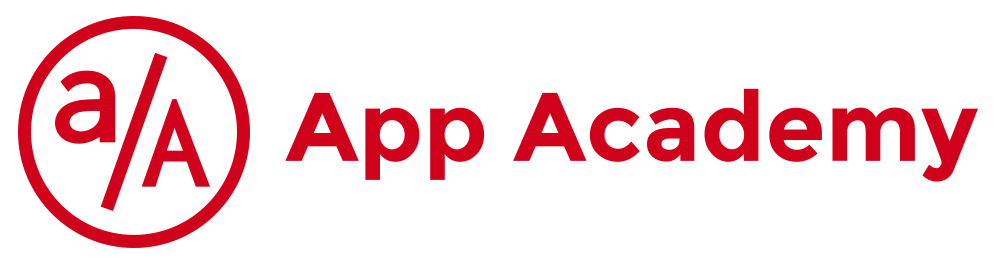

# App Academy Open Practice Repository

Welcome to the **App Academy Open Practice Repository** — a curated collection of exercises, and projects from the [App Academy Open](https://open.appacademy.io/) curriculum. This repository documents my hands-on learning in:

- ⚛️  **JavaScript Full Stack**
- 🐍 **Python Web Development**
- 🌐 **Web Services & APIs**

## 📁 Structure

> Folder names and contents may evolve as the curriculum progresses.

## 🛠 Technologies Covered

- **Front-End:** HTML5, CSS3, JavaScript (ES6+), React.js, Redux
- **Back-End:** Python (Flask), Node.js, Express.js
- **Database:** PostgreSQL, SQLAlchemy, Sequelize
- **Other Tools:** Git, GitHub, Docker, RESTful APIs

## 🚀 Getting Started

Clone the repository:

```bash
git clone https://github.com/your-username/app-academy-open.git
cd app-academy-open
```

Install dependencies and run individual projects as instructed in each folder’s `README.md`.

> ⚠️ Some projects may require PostgreSQL setup, Python virtual environments, or Node dependencies.

## 📚 Learning Goals

- Solidify full-stack engineering skills by building real-world applications.
- Understand the principles of modern web development, including routing, state management, and API integration.
- Practice test-driven development and version control.

---

**This repository reflects my individual learning journey and is continuously evolving.**  
Check back for new additions and improvements!

